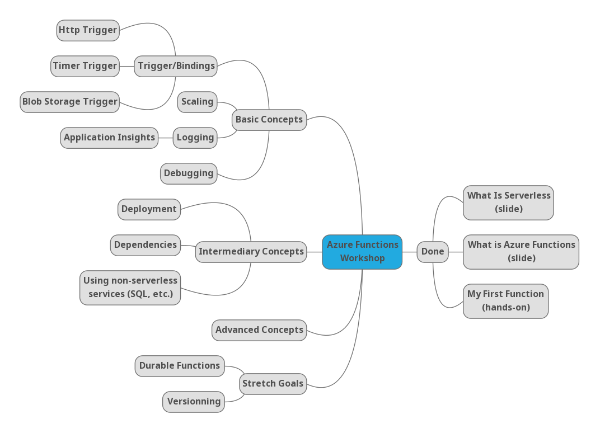

# Azure Functions Workshop

## Mindmap and Plan of work

## Goal

This Azure Functions workshop is intended for people wanting to learn about serverless and what kind of problems it solved. Code sample will be provided in C#, JavaScript, Python, and Java.

The workshop will be a mixed of Slides to set context with as many hands-on experience that can be fit with the initial context.

## Target Audience

This workshops is targeting developers who have a minimal amount of knowledge about serverless.

Here's a sample of audiences that might be interested in this content:

* Businesses
* Students and Teachers
* Startups

## Contribute

If you wish to contribute, feel free to submit Pull Requests.

Please reach out to me on [Twitter](https://twitter.com/MaximRouiller) if you wish to discuss this project.
