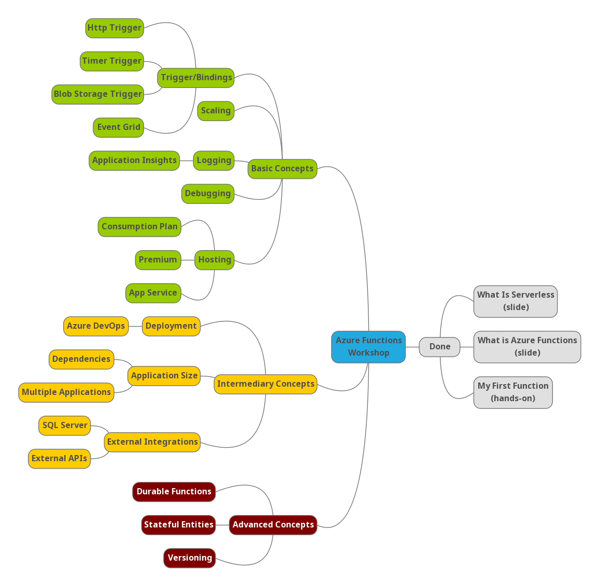

# Azure Functions Workshop

## Current Content Location

* [Azure Functions Workshop](https://github.com/MaximRouiller/AzureFunctions-Workshop/tree/master/src/content/workshops/functions)

## Mindmap and Plan of work



## Goal

This Azure Functions workshop is intended for people wanting to learn about serverless and what kind of problems it solved. Code sample will be provided in C#, JavaScript, Python, and Java.

The workshop will be a mixed of Slides to set context with as many hands-on experience that can be fit with the initial context.

## Target Audience

This workshops is targeting developers who have a minimal amount of knowledge about serverless.

Here's a sample of audiences that might be interested in this content:

* Businesses
* Students and Teachers
* Startups

## Contribute

If you wish to contribute, start by cloning the repository:

```sh
> git clone https://github.com/MaximRouiller/AzureFunctions-Workshop.git
```

Then restore the submodules:

```sh
> git submodule update --init --recursive
```

You can run it locally using the VS Code task `Run Server` or using the Hugo cli (which is in the repositroy root):

```sh
> ./hugo serve --source ./src
```

Then make your changes and submit a Pull Request! 😁

Please reach out to me on [Twitter](https://twitter.com/MaximRouiller) if you wish to discuss this project.
