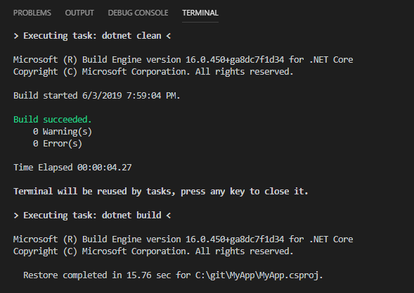
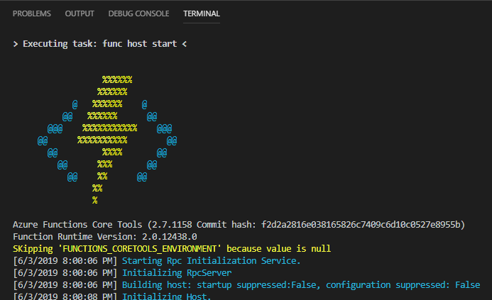
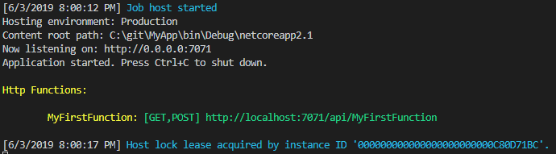
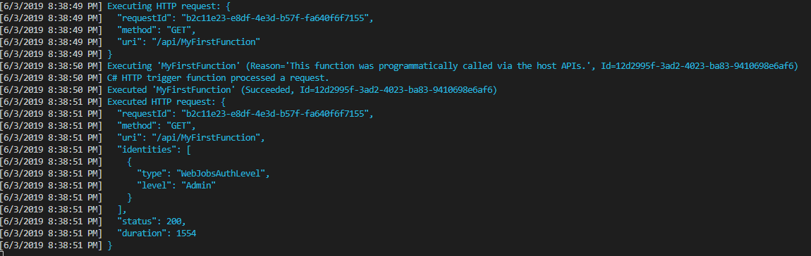

### Goal

Before we can move to creating serverless applications, we must first create our first function.

### Steps for C#

1) We create a folder in D:\git\MyApp
2) We open VS Code folder D:\git\MyApp
3) CTRL-SHIFT-P `Azure Functions: Create New Project...`
    1. Current folder
    2. C# (Requires .NET Core SDK)
    3. Azure Functions V2
    4. HttpTrigger
    5. FunctionName: MyFirstFunction
    6. Namespace: MyApp
    7. Access Rights: Function

This will create your very first function in the file named `MyFirstFunction.cs`.

#### The code

```csharp
using System;
using System.IO;
using System.Threading.Tasks;
using Microsoft.AspNetCore.Mvc;
using Microsoft.Azure.WebJobs;
using Microsoft.Azure.WebJobs.Extensions.Http;
using Microsoft.AspNetCore.Http;
using Microsoft.Extensions.Logging;
using Newtonsoft.Json;

namespace MyApp
{
    public static class MyFirstFunction
    {
        [FunctionName("MyFirstFunction")]
        public static async Task<IActionResult> Run(
            [HttpTrigger(AuthorizationLevel.Function, "get", "post", Route = null)] HttpRequest req,
            ILogger log)
        {
            log.LogInformation("C# HTTP trigger function processed a request.");

            string name = req.Query["name"];

            string requestBody = await new StreamReader(req.Body).ReadToEndAsync();
            dynamic data = JsonConvert.DeserializeObject(requestBody);
            name = name ?? data?.name;

            return name != null
                ? (ActionResult)new OkObjectResult($"Hello, {name}")
                : new BadRequestObjectResult("Please pass a name on the query string or in the request body");
        }
    }
}
```

Let's decompose everything we see in this sample.

`[FunctionName("MyFirstFunctionName")]` is how you define a function in C#. The name of the method (`Run` in our case) is not important and will run nonetheless. This attribute can only be applied on a static method.

Functions always starts with a trigger. In our case, we're using an `HttpTrigger` as to execute a Function when an HTTP request is invoked. That parameter uses C# Attributes to define our `HttpRequest req` as our Trigger. We define some security level and the HTTP methods for which we will respond.

The last parameter of that method is `ILogger log` which is an external dependency that is automatically created for us. It will allow us to use the Azure Functions logging tools to output log information into our console.

The rest of the method is quickly retrieving the `name` parameter from the query and returning an appropriate result on whether it's null or not.

It's important to note here that the `return` keyword here is used as an *Output Binding*. An output binding is the result that is emitted from an Azure Function. Right now, it's an `ActionResult` from ASP.NET MVC but it could be many other things including files and complex objects.

#### Running the code

To ensure everything works nicely, let's launch this function right now by pressing F5.

The terminal will open. Tons of steps are going to be happening within Visual Studio Code Terminal.



The first steps you are going to see is a `dotnet clean`. This is the first clue that Azure Functions is running with .NET Core.

.NET Core is a cross platform runtime that allows you to run on Mac, Linux, and Windows.

Here's the list of commands that are going to be run everytime we press F5.

```bash
dotnet clean
dotnet build
func host start
```

`dotnet build` will compile our function and have it execution ready in a compiled state.

`func host start` will tell the Azure Functions runtime to start hosting our function so that we can start triggering some events.

As soon as we see the easily recognizible Azure Functions logo, we know that we have installed Azure Functions correctly.



Please take a minute to notice right below the logo the different versions of the different tools that is being used. The `Azure Functions Core Tools` is the version of the NPM package that we are currently using while the `Function Runtime Version` is the version of .NET Core runtime that is actually executing our function.

Once everything has finished printing to the screen, you should se the following on your screen.



#### Testing the state of our function

The previous steps confirms that our function is successfully being hosted on Azure Functions runtime. We now need to confirm that everything is working fine.

Open the link below in a different tab of your browser.

http://localhost:7071/api/MyFirstFunction?name=John

In our browser, we should see the following.

> Hello, John

Back in our Visual Studio Terminal, we will the see the following output.



This output is a good summary of all the information that was sent to your function when it started executing, when it completed execution, and how it ended.

Congratulation! You just completed your first function!

### Reference Documentation

- [FunctionName valid parameters/name/etc](https://docs.microsoft.com/en-us/azure/azure-functions/functions-dotnet-class-library#methods-recognized-as-functions)
- [HttpTrigger](https://docs.microsoft.com/en-us/azure/azure-functions/functions-bindings-http-webhook#trigger)